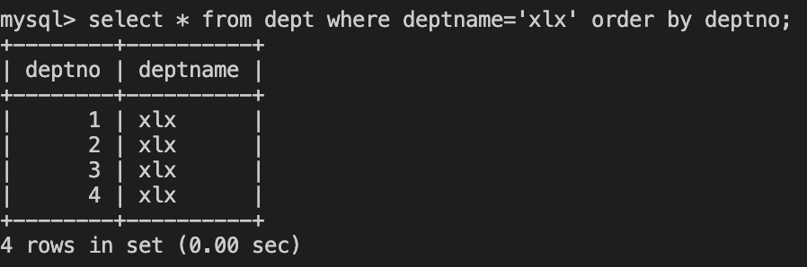

# 基本SQL语句

分为三种
DDL:数据定义语句，主要对数据库和表的字段进行修改和定义
DML:数据操纵语句，主要对表中的记录进行增删改查操纵
DCL:数据控制语句，对不同数据段定义安全级别

## DDL:数据定义语句

1.创建数据库

```
create databases test；//创建数据库
```

2.查看数据库

```
show databases; //查看数据库
```

3.删除数据库

```
drop databases test;//删除test数据库

```

4.创建表

```
create table user(name varchar(10),passwd int(10));//创建表 user 字段name和passwd
```

5.查看表

```
desc user;
show create table user \G; //查看更详细的信息存储引擎什么的
```

6.删除表

```
drop table user；
```

7.修改表
1.修改字段类型

```
alter table  user modify passwd int(20);
```

2.将字段改名

```
alter table  user change passwd  password int(30);
```

3.增加表字段

```
alter table user add ID int(5) first; //在第一列增加id字段
alter table user add sex varchar(2);//默认在最后一列增加sex段
alter table user age int(5) after id; //在id段之后增加age段
```

4.将表改名

```
alter table user rname users；
```

## DML语句

对表进行增删改查操作

### 1.插入记录

1.可以一次插入多条记录

```
insert into user (username,passwd) values("a",1262),("b",67623);
```

2.可以不显示制定字段列表 插入的值要与字段顺序一样

```
insert into user values("a",1262),("b",67623);
```

3.删除记录

```
可以删除单个数据可以删除多个数据
delete from emp where ename='lisa';
delete from emp;//删除所有数据
delete a,b from emp a,dept b where a.deptno=b.deptno and a.deptno=3;//多条件删除语句
```

### 2.修改记录

update emp set sal=4000 where enmae='lisa' //将lisa薪水修改为4000；
update a,b from emp a,dept b set a.sal=a.sal*b.deptno, b.deptname=a.ename where a.deptnp=b.deptno;

### 3.查询记录

#### 1.distinct 查询记录去重

```
select distinct * from user;
select distinct username from user;
```

#### 2.where 实现条件查询

```

select * from emp where deptno=1 and sal<3000;
```

#### 3.order by 排序

```
select * from dept where deptname='xlx' order by deptno limit 3;
```



<style>#mermaid-1685671248894{font-family:"trebuchet ms",verdana,arial;font-size:16px;fill:#ccc;}#mermaid-1685671248894 .error-icon{fill:#a44141;}#mermaid-1685671248894 .error-text{fill:#ddd;stroke:#ddd;}#mermaid-1685671248894 .edge-thickness-normal{stroke-width:2px;}#mermaid-1685671248894 .edge-thickness-thick{stroke-width:3.5px;}#mermaid-1685671248894 .edge-pattern-solid{stroke-dasharray:0;}#mermaid-1685671248894 .edge-pattern-dashed{stroke-dasharray:3;}#mermaid-1685671248894 .edge-pattern-dotted{stroke-dasharray:2;}#mermaid-1685671248894 .marker{fill:lightgrey;}#mermaid-1685671248894 .marker.cross{stroke:lightgrey;}#mermaid-1685671248894 svg{font-family:"trebuchet ms",verdana,arial;font-size:16px;}#mermaid-1685671248894 .label{font-family:"trebuchet ms",verdana,arial;color:#ccc;}#mermaid-1685671248894 .label text{fill:#ccc;}#mermaid-1685671248894 .node rect,#mermaid-1685671248894 .node circle,#mermaid-1685671248894 .node ellipse,#mermaid-1685671248894 .node polygon,#mermaid-1685671248894 .node path{fill:#1f2020;stroke:#81B1DB;stroke-width:1px;}#mermaid-1685671248894 .node .label{text-align:center;}#mermaid-1685671248894 .node.clickable{cursor:pointer;}#mermaid-1685671248894 .arrowheadPath{fill:lightgrey;}#mermaid-1685671248894 .edgePath .path{stroke:lightgrey;stroke-width:1.5px;}#mermaid-1685671248894 .flowchart-link{stroke:lightgrey;fill:none;}#mermaid-1685671248894 .edgeLabel{background-color:hsl(0,0%,34.4117647059%);text-align:center;}#mermaid-1685671248894 .edgeLabel rect{opacity:0.5;background-color:hsl(0,0%,34.4117647059%);fill:hsl(0,0%,34.4117647059%);}#mermaid-1685671248894 .cluster rect{fill:hsl(180,1.5873015873%,28.3529411765%);stroke:rgba(255,255,255,0.25);stroke-width:1px;}#mermaid-1685671248894 .cluster text{fill:#F9FFFE;}#mermaid-1685671248894 div.mermaidTooltip{position:absolute;text-align:center;max-width:200px;padding:2px;font-family:"trebuchet ms",verdana,arial;font-size:12px;background:hsl(20,1.5873015873%,12.3529411765%);border:1px solid rgba(255,255,255,0.25);border-radius:2px;pointer-events:none;z-index:100;}#mermaid-1685671248894:root{--mermaid-font-family:sans-serif;}#mermaid-1685671248894:root{--mermaid-alt-font-family:sans-serif;}#mermaid-1685671248894 flowchart{fill:apa;}</style>

#### 4.聚合

1.with rollup对分类后的结果进行在混总

```
select deptno,count(1) from emp group by deptno with rollup; //表示按照部门分类
```

2.having 对查询后的结果在筛选

```
select deptno,count(1) from emp group by deptno having count(1)>1; //表示按照部门分类
```

#### 5.表连接
1.左连接：包含所有左边表中的记录甚至是右边表中没有和它匹配的记录
```
select enmae,deptname from emp left join dept on emp.deptno=dept.deptno;
```
2.右连接：包含所有右边表中的记录甚至是左边表中没有和它匹配的记录

#### 6.子查询
1.需要的条件是另外一个select语句查询结果 in, not in,=,!=,exists,not exists等
```
select * from emp where deptno in(select deptno from dept)
```
#### 7.记录联合
1.union 去重显示结果
2.union all 不去重显示结果 
select deptno from emp union all select deptno from emp;
